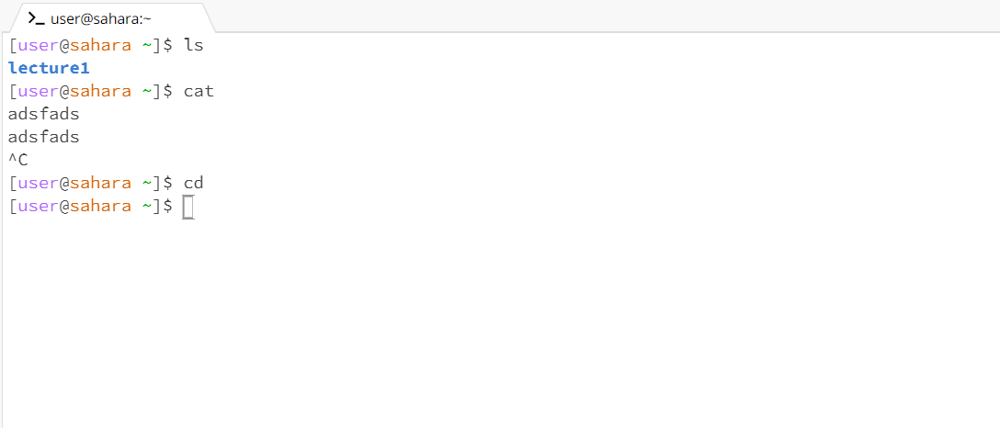
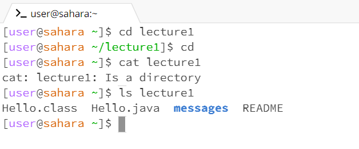
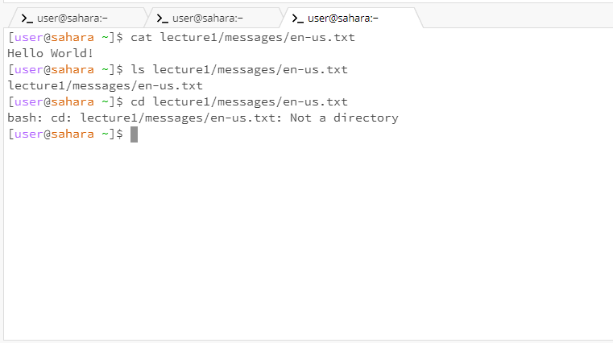

1. Share an example of using the command with no arguments.
Answer: 
Working directory: Home directory.
Explanation: The ls command without arguments just lists files and directories in home directory and there is only one diretory named lecture1. 
The cat command without arguments waits for an input from my keyboard. So, when I typed adsfads, the cat command prints adsfads as it is.
Lastly, the cd command without arguments drives us back to home directory. Therefore, if we are in home directory when we put the cd command, the cd command changes nothing. 
Error: N/A.

2. Share an exmaple of using the command with a path to a directory as an argument.
Answer: 
Working directory: Home directory. 
Explanation: The cd command with a directory as an argument drives us to that directory declared as an argument. For example, in this case, I used lecture1 directory as an argument so the cd command drives me from home directory to lecture1 directory.
The cat command with a directory as an argument prints a message which helps us discriminate the declared argument is a directory. In this case, since the argument lecture1 is a directory, the cat command prints the message that "cat: lecture1: Is a directory".
The ls command with a directory as an argument lists all files and directories in the declared arugment. If "ls lecture1" is declared, the command lists all directories and files in the lecture1 directory which are messages, Hello.class, Hello.java, and README. 
Error: N/A.

3. Share an example of using the command with a path to a file as an argument.
Answer: 
Working directory: Home directory.
Explanation: The cat command prints the message in en-us.txt file (Hello World!).
Since there are no more directories or files to list in en-us.txt file, the ls command just lists all directories and files in the path (lecture1/messages/en-us.txt).
The cd command is used for changing the current working directory. However, en-us.txt is not a directory, but a file. The cd command cannot changes the current working directory into a file, so the command does not pass and prints an error (bash: cd: lecture1/messages/en-us.txt: Not a directory). 
Error: the cd command.
