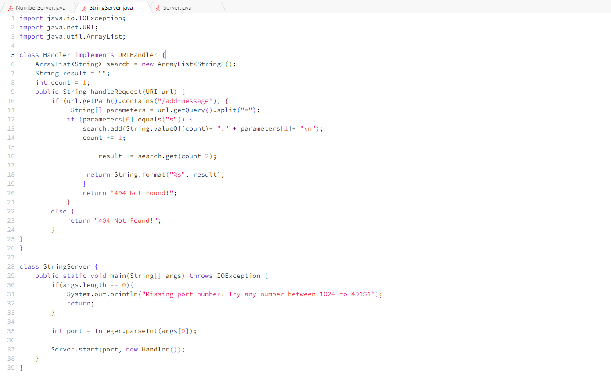
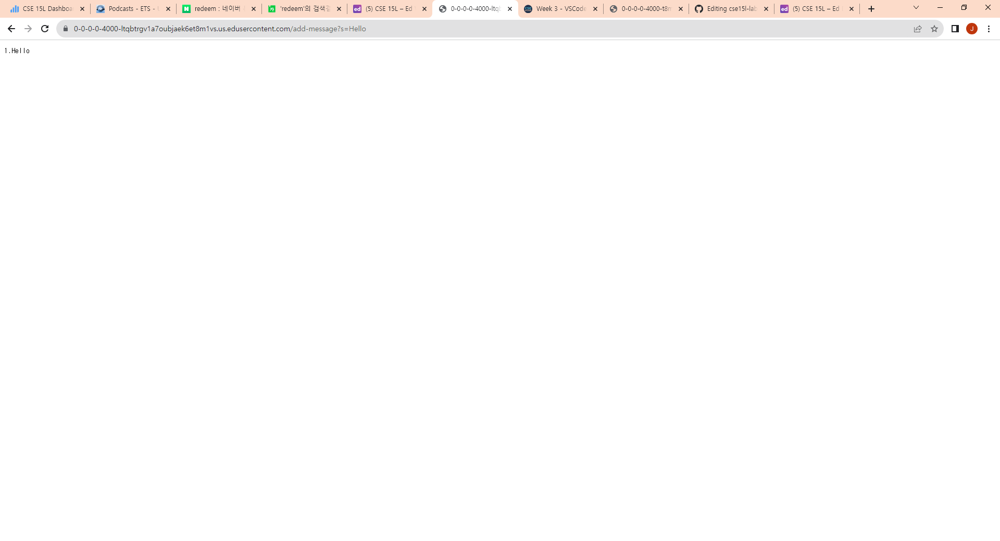
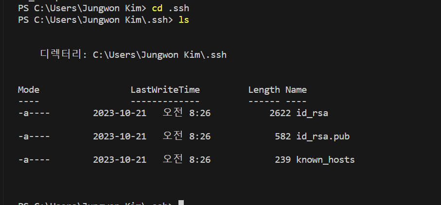
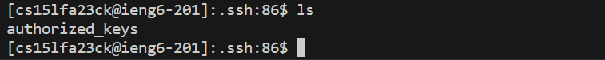

   

   Which methods in your code are called?
   - handleRequest method and main method are called.
   
   What are the relevant arguments to those methods, and the values of any relevant fields of the class?
   - relevant arguments: URI url, String[] args | relevant fields: ArrayList<String> search, String result, int count, String[] parameters
   
   How do the values of any relevant fields of the class change from this specific request? If no values got changed, explain why.
   - URI url -> https://0-0-0-0-4000-vl2ne1fp7f2ddbc7iilvb972rk.us.edusercontent.com/add-message?s=Hello
   - String[] args -> [4000]
   - ArrayList<String> search -> ["1. Hello " + "\n"]
   - String result -> "1. Hello" + "\n"
   - String[] parameters -> ["s", "Hello"]
   

   
   Which methods in your code are called?
   - handleRequest method and main method are called.
   
   What are the relevant arguments to those methods, and the values of any relevant fields of the class?
   - relevant arguments: URI url, String[] args | relevant fields: ArrayList<String> search, String result, int count, String[] parameters
   
   How do the values of any relevant fields of the class change from this specific request? If no values got changed, explain why.
   - URI url -> https://0-0-0-0-4000-vl2ne1fp7f2ddbc7iilvb972rk.us.edusercontent.com/add-message?s=How are you
   - String[] args -> [4000]
   - ArrayList<String> search -> ["1. Hello " + "\n", "2. How+are+you" + "\n"]
   - String result -> "1. Hello" + "\n" + "2. How+are+you" +"\n"
   - String[] parameters -> ["s", "How+are+you"]

1. The path to the private key for your SSH key for logging into ieng6(on your computer)
   
   id_rsa file is the prviate key and id_rsa.pub is the public key.

2. The path to the public key for your SSH key for logging into ieng6(within your account on ieng6)
   
   Since I ran the command "scp C:\Users\Jungwon Kim/.ssh/id_rsa.pub cs15lfa23ck@ieng6.ucsd.edu:~/.ssh/authorized_keys", my public ssh key (id_rsa.pub) will be copied in a file called authorized_keys. Since authorized_keys is a file not a directory, I cannot go into there by cd command
   but my public ssh key (id_rsa.pub) will be stored inside the authorized_keys file. 

In week 2, I learned how to remotely connect to the server, build and run the server. Also, I learned the structure of URL and how URL works. Especially, path, query and fragment. In week 3, the main thing I learned was SSH keys. Especially, private and public keys.
Also, I learend new cmd commands, which are scp and mkdir. 
