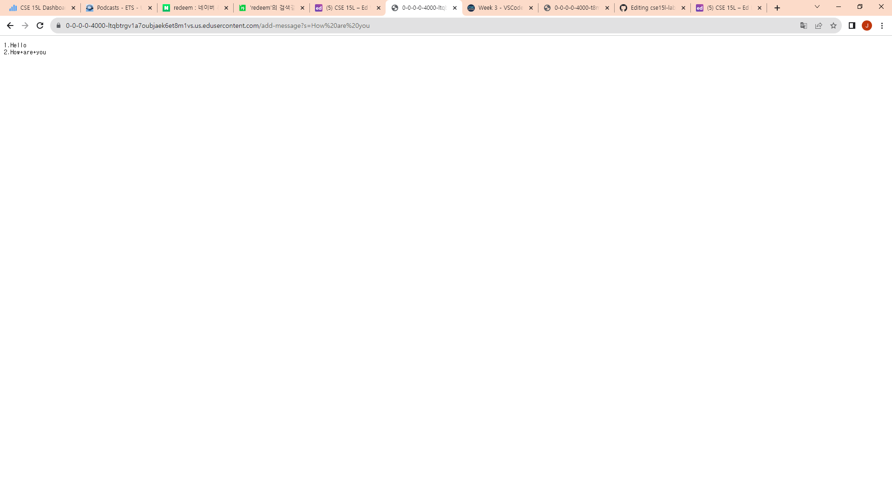
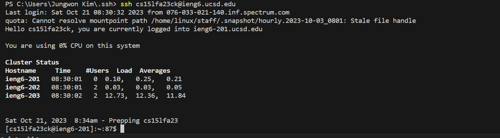

   

   Which methods in your code are called?
   - handleRequest method and main method are called.
   
   What are the relevant arguments to those methods, and the values of any relevant fields of the class?
   - relevant arguments: URI url, String[] args | relevant fields: ArrayList<String> search, String result, int count, String[] parameters
   
   How do the values of any relevant fields of the class change from this specific request? If no values got changed, explain why.
   - URI url -> https://0-0-0-0-4000-vl2ne1fp7f2ddbc7iilvb972rk.us.edusercontent.com/add-message?s=Hello
   - String[] args -> [4000]
   - ArrayList<String> search -> ["1. Hello " + "\n"]
   - String result -> "1. Hello" + "\n"
   - String[] parameters -> ["s", "Hello"]
   

   
   Which methods in your code are called?
   - handleRequest method and main method are called.
   
   What are the relevant arguments to those methods, and the values of any relevant fields of the class?
   - relevant arguments: URI url, String[] args | relevant fields: ArrayList<String> search, String result, int count, String[] parameters
   
   How do the values of any relevant fields of the class change from this specific request? If no values got changed, explain why.
   - URI url -> https://0-0-0-0-4000-vl2ne1fp7f2ddbc7iilvb972rk.us.edusercontent.com/add-message?s=How are you
   - String[] args -> [4000]
   - ArrayList<String> search -> ["1. Hello " + "\n", "2. How+are+you" + "\n"]
   - String result -> "1. Hello" + "\n" + "2. How+are+you" +"\n"
   - String[] parameters -> ["s", "How+are+you"]

In week 2, I learned how to remotely connect to the server, build and run the server. Also, I learned the structure of URL and how URL works. Especially, path, query and fragment. In week 3, the main thing I learned was SSH keys. Especially, private and public keys.
Also, I learend new cmd commands, which are scp and mkdir. 
