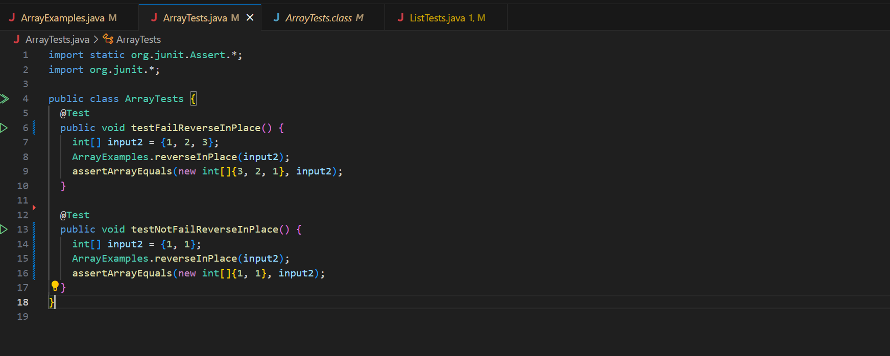

Part1. A bug of reverseInPlace method in ArrayExamples class. 

1. A failure-inducing input as a JUnit test.
  ```java
  @Test
  public void testFailReverseInPlace() {
    int[] input2 = {1, 2, 3};
    ArrayExamples.reverseInPlace(input2);
    assertArrayEquals(new int[]{3, 2, 1}, input2);
  }
  ```
2. An input that does not induce a failure, as a Junit Test.
  ```java
  @Test
  public void testNotFailReverseInPlace() {
    int[] input2 = {1, 1};
    ArrayExamples.reverseInPlace(input2);
    assertArrayEquals(new int[]{1, 1}, input2);
  }
  ```
3. The symptom, as the output of running the tests.
  
  
  testFailReverseInPlace() failed and testNotFailReverseInPlace() passed.

5. The bug, as the before-and-after code
  - Before
    ```java
    static void reverseInPlace(int[] arr) {
      for(int i = 0; i < arr.length; i += 1) {
        arr[i] = arr[arr.length - i - 1];
      }
    }
    ```
  - After
    ```java
    static void reverseInPlace(int[] arr) {
      for(int i = 0; i < arr.length/2; i+=1) {
        int temp = arr[i];
        arr[i] = arr[arr.length -i -1];
        arr[arr.length-i-1] = temp;
      }
    }
    ```
5. Briefly describe why the fix addresses the issue.
  Since we are changing values of the input array in itself, we need a temporary int variable that stores previous value. By this temp variable idea, we can easily swap two values within the input array. Swap the first and the last, second and last-1. Keep going until we reach the half of the array which means
  we finished reversing in place. 


Part2. Researching Commands : grep

1. grep -E
  ```
  grep -E 'answer|problem' ./technical/biomed/1468-6708-3-3.txt
  The problem
  (MIRACL) trial set out to answer this question.
  The answer?
  grep -E 'Intro|Six' ./technical/biomed/1468-6708-3-1.txt
  Introduction
  Six large controlled population-based studies of
  ```
  -E option allows that the pattern is an extended regular expression. It is useful because we can search multiple patterns at once. If we use grep without -E option, the patteren will recognize 'answer|problem' as a single string itself. 
  The first example prints all the lines that contain "answer" or "problem" key words. The second example prints all the lines that contain "Intro" or "Six" key words. 
  
  citation: https://csiro-data-school.github.io/regex/03-egrep-find/index.html
  
2. grep -i
  ```
  grep -i 'intro' ./technical/biomed/1468-6708-3-1.txt
  Introduction
  grep -i 'six' ./technical/biomed/1468-6708-3-1.txt
  Six large controlled population-based studies of
  examining health status over time, we added a sixth
  ```
  -i option ignores case distinctions. It is useful when we want to ignore case distinctions of the input patterns. 
  The first example prints all the lines that contain "intro" key word regardless of case distinctions. The second example prints all the lines that contain "six" key word regardless of case distinctions. 

  citation: grep --help (git bash terminal) 

3. grep -w
  ```
  grep -w 'adult' ./technical/biomed/1468-6708-3-1.txt
  throughout adult life. It may be that a small amount of
  average older adult; however, adjustment for detailed
  grep -w 'adults' ./technical/biomed/1468-6708-3-1.txt
  Older adults are frequently counseled to lose weight,
  non-smoking older adults have investigated the association
  adults drew similar conclusions [ 7 ] .
  Many healthy older adults report gradual weight gain
  In older adults, risk factors may have a greater effect
  years of being healthy, in a cohort of older adults for
  modification interventions in older adults.
  population-based longitudinal study of 5,888 adults aged
  categories could be combined for older adults. Since
  interventions for older adults who were merely overweight
  adults are the subjects. This is particularly important
  33 34 ] . For older adults, the risks associated with
  outcome for a trial of weight loss in older adults
  found for underweight older adults. Clinical trials whose
  older adults, especially for women. Future efforts to
  no excess risk for older adults who would be classified as
  obese or underweight older adults, and discouraging trials
  that address older adults who are merely overweight.
  ```
  -w option selects only those lines containing matches that form whole words. It is useful when we do not want to include the lines containing a word of which the pattern is a substring. 
  The first example prints all the lines that contain exactly "adult" whole key word. The second example prints all the lines that contain exactly "adults" whole key word. 

  citation: https://unix.stackexchange.com/questions/524828/what-does-grep-w-do

4. grep -c
  ```
  grep -c 'adult' ./technical/biomed/1468-6708-3-1.txt
  20
  grep -c 'Intro' ./technical/biomed/1468-6708-3-1.txt
  1
  ```
  -c option prints the number of lines of output context. It is useful when we just want to know how many lines matching with the input pattern there are.
  The first example prints the number of lines that contain "adult" key word. The second example prints the number of lines that contain "Intro" key word. 

  citation: grep --help (git bash terminal)
