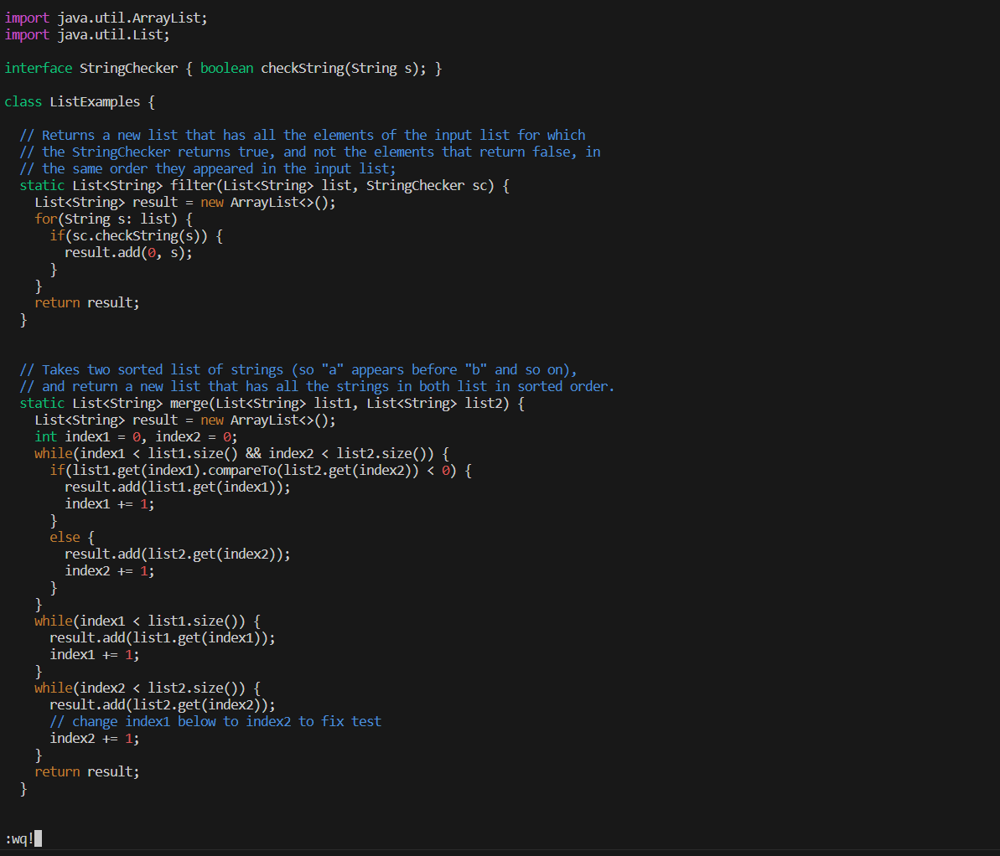

- Step 4
```
Keys pressed: ssh <space> cs15lfa23ck@ieng6-201.ucsd.edu <enter>
The command for loging into remote server ieng6.
```


- Step 5
```
Keys pressed: git <space> clone <space> git@github.com:Drowsyyyyy/lab7.git <enter>
The command for git cloning lab7 forked repository with ssh clone URLs.
```


- Step 6
```
Keys pressed: ls <enter>, cd <space> lab7 <enter>, ls <enter>
bash <space> test.sh <enter>
First, check all directories in my ieng6 account by ls command.
Next, change my current working directory as lab7 cloned repositoy
by cd lab7 command.
Next, ls again to check what files we have in lab7 repository.
Finally, run the test with provided bash script by bash test.sh command.
```


- Step 7
```
Keys pressed: vim <space> ListExamples.java <enter>
/index1 <enter>, <shift> n, e, a, <backspace>, 2, <esc>, :wq!, <enter>
First, vim ListExamples.java file to edit the bug.
Next, search all index1 words in the file by /index1.
Next, press shift n to go bottom where we need to fix the code.
Next, press e to move the cursor to the last character of the next word.
Next, press a to enter insert mode right after the current character.
Next, press backspace to delete "1" and press 2 to input "2".
Next, press esc to exit insert mode and type :wq! to save and close.
```





- Step 8
```
Keys pressed: bash <space> test.sh <enter>
Run the test with provided bash script by bash test.sh command.
```


- Step 9
```
Keys pressed: git <space> status <enter>
git <space> add <space> ListExamples.java <enter>
git <space> commit <space> -m <space> "added <space> ListExamples.java" <enter>
git <space> log
git <space> push <space> origin <psace> main
```
```
First, check which file is modified by git status command.
Since we only make changes in ListExamples.java file,
add changes by git add ListExamples.java command.
Next, commit and push with commit message "added ListExamples.java"
by git commit -m "added ListExamples.java" and git push origin main command.
Finally, check wheter the resulting change is successfully committed and pushed
to my Github account by git log command.
```


