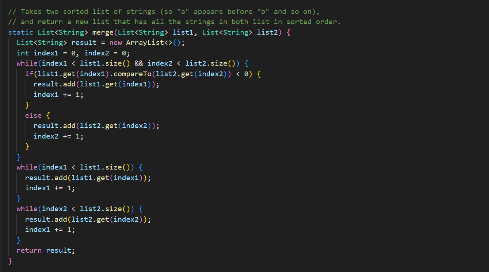
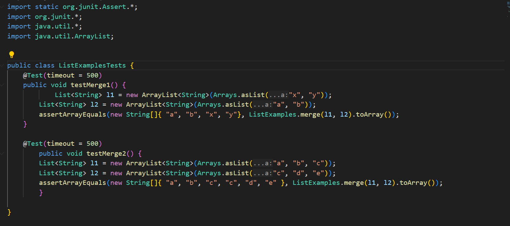
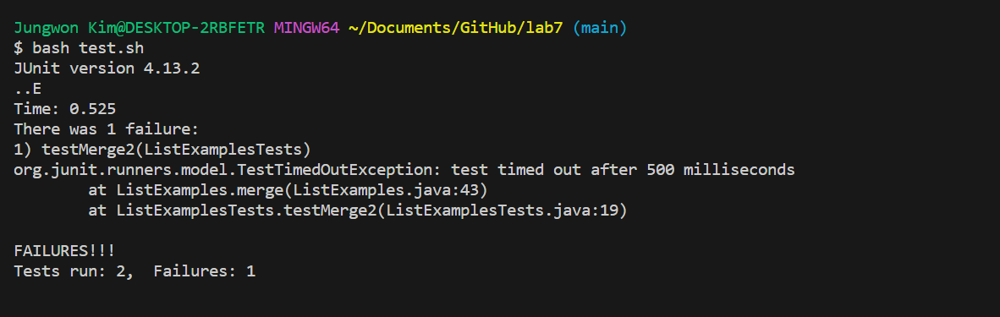
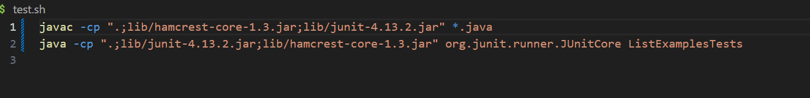
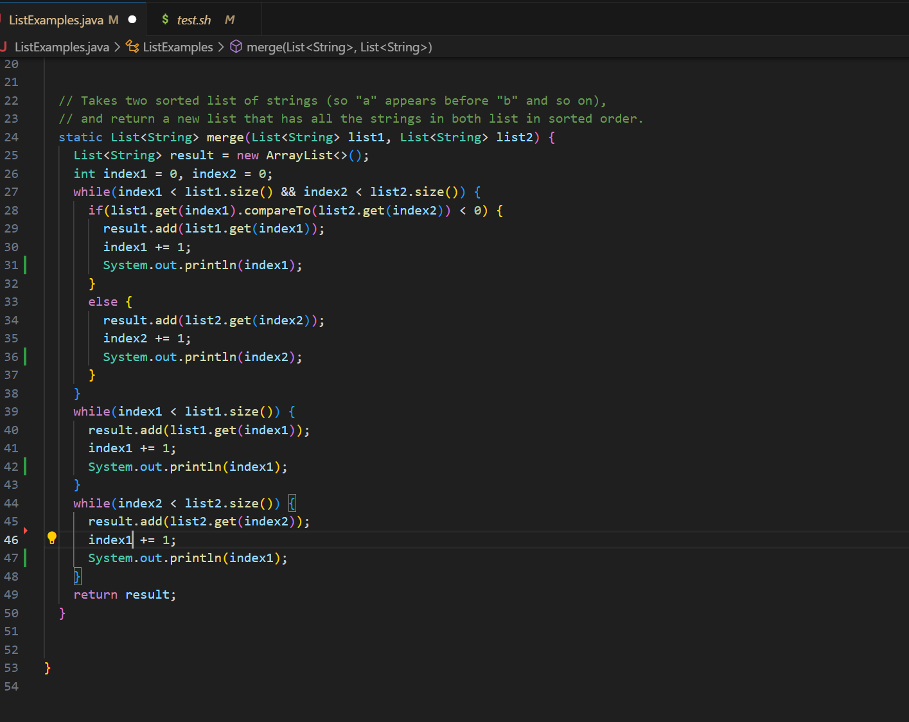
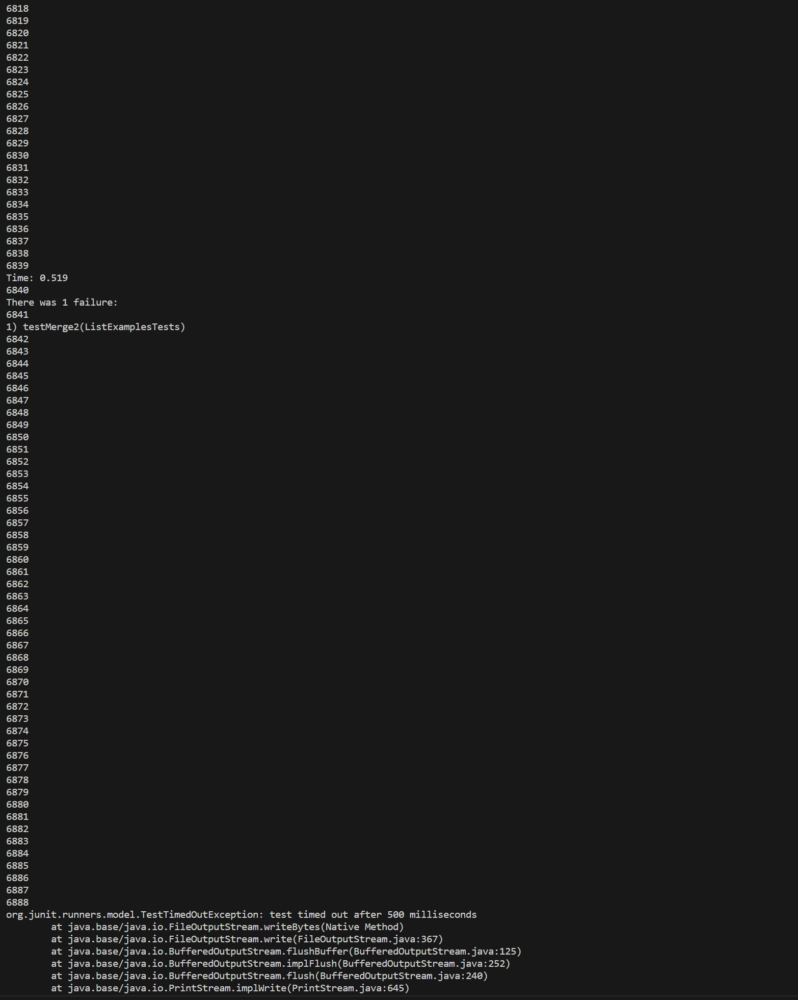
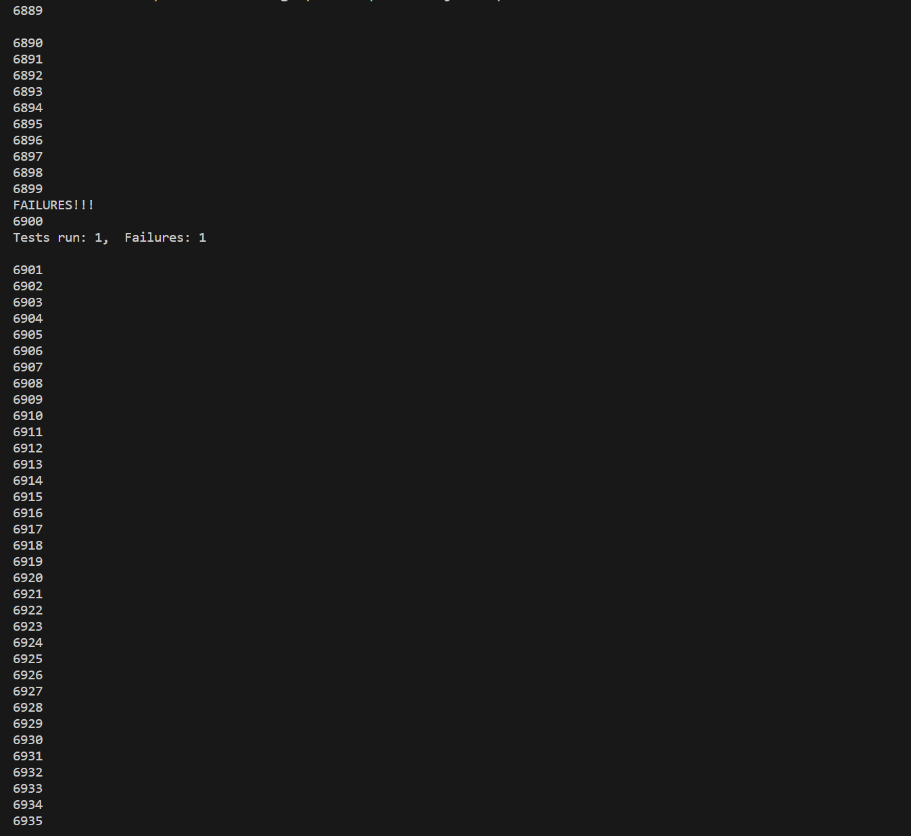
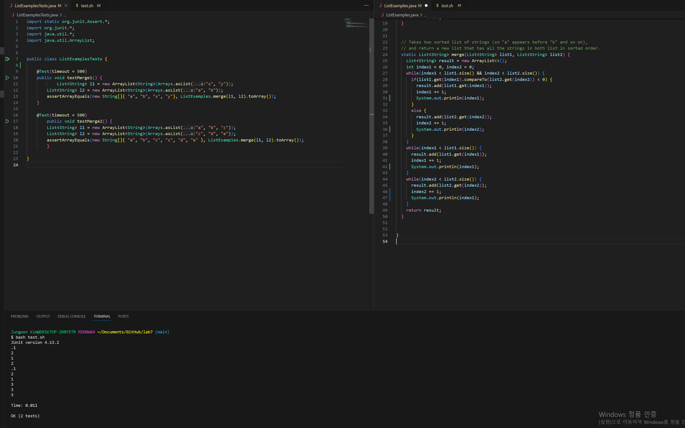

- The original post from student 

Hi! I have a question about how to resolve this bug. Here is screenshots for the merge method, Junit tests, and bash script. I tried two tests. The first test passed, but the second failed. 
It seems like working partially well since the first test passed. In the terminal output, it says that testMerge2 timed out after 500 milliseconds. 
I have no idea how to deal with time-out errors. Also, I have no idea why the first test passed but the second test failed. 
What differences between test 1 and test 2 induce the time-out error? 

- Answer from TA 

Hello! Usually, time-out errors happen when there are bugs in your loops. I would suggest you to check thoroughly your while loops. 
When checking your while loops, you should check both conditions and how the values of loop counters change with each iteration of loops.
You could easily check how the values of loop counters change by adding System.out.println(loop counters); inside while loop after changing the values. 

- Answer from student

Hi! Thank you for your advise! I figured out that one of my while loops is going to the infinite loop. 
I added System.out.println(loop counter) in all my while loops and the numbers increase infinitely and stopped at some point since there is a time limit in test method. 
I searched for which while loop is causing infinite loop and found that the while loop with condition (index2 < list2.size()) does not have correct loop counter matching with the condtion. 
It is increasing index1 with each iteration even though this while loop is for adding rest elements in list2. 
Since local varaible index2 is the variable for list2, I changed index1 to index2 and it fixed the problem! 

- Part 2: Reflection

I learned a lot from the second half of this quarter. However, if I need to pick one topic which was the most interesting for me, I would pick Vim command.
When we learned about remote server things in the first half of this quarter, we learned how to add and delete files and directories using commands touch, mkdir, rm -rf, etc. 
However, I wonder what we should do if we want to edit the files we added to a remote server. Vim command answered to my all curiosities. 
